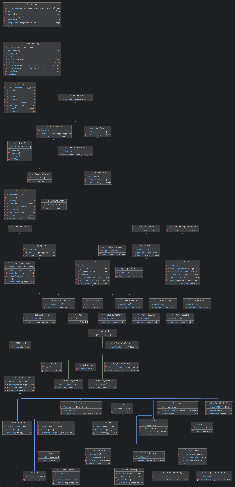

ImageCitationAndPermission:

#### Sample Image Path inside the Project : **Assignment4Part1(IME)

/test/resources/manhattan-small.png**

    All Image used within the project file are owned by Project owners and can be used for testing for project purposes. (Self Taken or Self Made Images)

<h2>How to RUN Script:</h2>

Currently, we support CLI commands and Script file

    load image-path image-name  
    save image-path image-name  
    red-component image-name dest-image-name  
    green-component image-name dest-image-name  
    blue-component image-name dest-image-name  
    value-component image-name dest-image-name  
    luma-component image-name dest-image-name  
    intensity-component image-name dest-image-name  
    horizontal-flip image-name dest-image-name  
    vertical-flip image-name dest-image-name  
    brighten alpha image-name dest-image-name 
    darken alpha image-name dest-image-name 
    rgb-split image-name dest-image-name-red dest-image-name-green dest-image-name-blue  
    rgb-combine image-name red-image green-image blue-image  
    blur image-name dest-image-name  
    sharpen image-name dest-image-name  
    sepia image-name dest-image-name  

To Run a script file use the below command:

<h3> run Path-to-script-file</h3>

Sample Script File (Requires Replacing Image path and destination as per your machine):

    load <inputFilePath> test
    red-component test redImage
    green-component test greenImage
    blue-component test blueImage
    value-component test valueImage
    intensity-component test intensityImage
    luma-component test lumaImage
    save <destinationPath>\red.png redImage
    save <destinationPath>\green.png greenImage
    save <destinationPath>\blue.png blueImage
    save <destinationPath>\value.png valueImage
    save <destinationPath>\intensity.png intensityImage
    save <destinationPath>\luma.png lumaImage
    exit

## Design Objective:

- Adhere to SOLID principles.
- Minimum to no changes to existing class files.
- Should be easy to onboard new operations.
- Avoid duplicate code.
- Follow configurable coding practices.

ClassDiagram :

---

## View:

### Interfaces:

1. **CommandExecutor**: Contains a method to start execution with a `run` method for listening to
   CLI commands.
    - **Class**:
        - `ImageProcessorCLI`: Implements the `run` method to continuously listen to user commands
          or script files.

2. **OperationCreator**: Contains methods to connect controllers to operations based on user
   commands.
    - **Class**:
        - `ImageOperationFactory`: Creates operation objects to connect CLI inputs and arguments to
          the controller interface.

---

## Controller:

### Interfaces:

1. #### **CLIOperation**: Mandates the `execute` method, which calls the operation class.
    - **Abstract Class**:
        - `AbstractOperation`: Manages the image cache per execution to store user images, supports
          adding and getting images, and validates command arguments.
            - **Abstract Class**:
                - `AdjustBrightness`: Conducts basic checks before handing over the image to
                  operations.
                    - `Brighten`: Overrides the `AdjustBrightness` execute method for brightness
                      operations.
                    - `Darken`: Overrides the `AdjustBrightness` execute method for darken
                      operations.
                - `Filter`: Handles calls to blur or sharpen methods by creating operations based on
                  the passed command.
                - `Flip`: Conducts sanity checks on arguments and the image involved in the
                  operation.
                    - `VerticalFlip`: Returns the vertical flip operation object to interact with
                      the model layer.
                    - `HorizontalFlip`: Returns the horizontal flip operation object.
                - `Visualize`: Manages requests to visualization functions (RGB component, luma,
                  intensity, and value).
            - **Classes**:
                - `CombineRGB`: Combines three images into one RGB image and validates dimensions
                  and values.
                - `Load`: Loads a given image from the path and uses the reader based on the image
                  format.
                - `Save`: Saves the image to the given path by converting it to a buffered image
                  before using the `ImageIO` JDK.
                - `Sepia`: Handles sepia image operations by request and argument validation.
                - `Compress`: Handles image compression requests by validating arguments and
                  executing the appropriate operations.

---

## Operations:

### Interfaces:

1. **ImageOperation**: Handles operations on a single image (e.g., Darken, Blur).
2. **MultiImageOperation**: Handles operations involving multiple images (e.g., combining R, G, B
   images).
3. **WaveletImageCompressor**: Handles compression based on the type of the wavelet transformation.

### Abstract Classes:

1. **AbstractVisualize**: Contains the generic `apply` operation for visualization and fetches the
   replacement value from each concrete class.
    - **Concrete Classes**:
        - `VisualizeRed`: Returns the red component of the image.
        - `VisualizeGreen`: Implements the method to return the green component of the image.
        - `VisualizeBlue`: Implements the method to return the blue component of the image.
        - `VisualizeLuma`: Rounds the luma value and returns it to the abstract class.
        - `VisualizeIntensity`: Returns the intensity of the image.
        - `VisualizeValue`: Returns the value component of the image.
2. **ApplyBrightness**: Applies the alpha value from the controller to the image.
3. **ApplyFlip**:
    - `ApplyHorizontalFlip`: Flips the image horizontally.
    - `ApplyVerticalFlip`: Flips the image vertically.
4. **Filter**: Applies the kernel by traversing all image points (Kernel Operations).
    - **Concrete Classes**:
        - `Blur`: Returns the Gaussian kernel matrix on the image.
        - `Sharpen`: Returns the sharpening 5x5 matrix for each pixel.
5. **Sepia**: Applies the sepia filter to the image by performing color transformations on
   individual pixels.
    - **Concrete Classes**:
        - `Sepia`: Returns the sepia filter applied image.
6. **Compress**: Compress the input image by the given value. Follows Haar Wavelet Transformation to
   transform the pixel array, zero out the less insignificant values computed based on the
   compression ratio.
    - **Concrete Classes**:
        - `HaarWaveletImageCompressor`: Applies haar wavelet compression to the given image by the
          following steps.
            - Apply haar wavelet transformation.
            - Zero out less insignificant values based on the compression ratio.
            - Invert the transformed sequence and create a corresponding image for the sequence.
            - Return the image.
        - `ApplyCompression`: Returns the compressed image.

### ImageIO:

1. **Interfaces**:
    - **ImageWriter**: Defines methods for writing image files to disk.
    - **ImageReader**: Defines methods for reading image files from disk.

2. **Abstract Classes**:
    - **AbstractWriter**:
        - `JPGImageWriter`: Provides functionality for writing JPG image files to disk.
        - `PNGImageWriter`: Provides functionality for writing PNG image files to disk.
        - `PPMImageWriter`: Represents a reader for images in PPM format from a specified file name.
        - `ImageWriterFactory`: Supplies the respective object based on the formats.

3. **Concrete Classes**:
    - `PPMImageReader`: Supplies the reader object specifically for PPM formats.
    - `ImageReaderFactory`: Supplies the respective reader objects.
    - `StandardImageReader`: Represents a reader for images in JPG and PNG formats from a specified
      file name.

### CHANGES:

1. New operations added: Compress, Histogram, Color Correction, Levels Adjustment.**(No design
   changes required.)**
    - The existing codebase remained unaltered to incorporate the new operations. Instead,
      we extended the system's functionality by introducing new command classes and their
      corresponding model classes. This approach allowed us to seamlessly integrate additional
      features without modifying the core structure, adhering to the principles of modularity and
      extensibility in software design.
    - For Every new operation we extended the ImageOperation.java interface and override the apply
      method with the new logics.
    - For new corresponding controllers, we have implemented the CLIOperations.java and extended the
      AbstractOperation.java abstract class tha contains the common validation and delegation
      logics.
2. We made few refactoring **as we hit the file limit(125)**. Following were the changes,
    - Removed the FileReader.java class. Moved the readFile method to the controller class,
      ImageProcessorCLI.java
    - Removed the individual controller classes for the operations such as Filter.java, Blur.java
      etc.,
      and moved them to ImageOperationFactory.java as inner classes.
    - Remove FilterConstants.java and moved the constants to their corresponding usage area.
3. Package Refactoring: More meaningful organisation.
    - imageio package from ime to controller.(ime ----> ime.controller).
    - Moved ImageLibrary.java to the package Repository and moved repository to
      ime.controller.operation package.

Assignment 6 Submission:

Design of Downscale:

The addition of Downscale feature was isolated changes and did not require any change to existing
design.

+ We created the model class (Downscale.java) where the logic was implemented.
+ A new controller (Downscale) was added as inner class in the controllers containing the argument
  validation and delegation to the model.
+ As our controller follows the Command Design patter, the new Command object creation is listed in
  the switch case to create the command object based on the user request string.

New file added (Model) : ime/model/operation/Downscale.java
Inner class added (Controller) : ime/controller/operation/ImageOperationFactory.java

